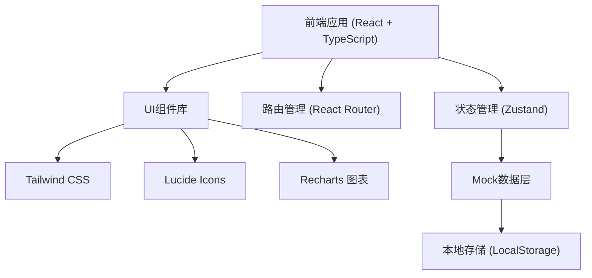
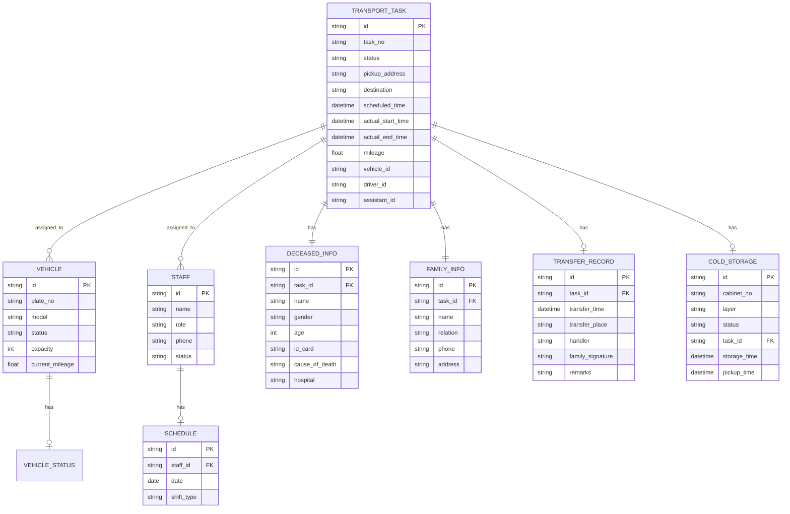

## 1. 架构设计



## 2. 技术描述

- **前端框架**：React@18 + TypeScript
- **构建工具**：Vite@5
- **路由管理**：react-router-dom@6
- **状态管理**：zustand@4
- **样式方案**：Tailwind CSS@3
- **图标库**：lucide-react
- **图表库**：recharts
- **数据模拟**：Mock数据 + LocalStorage持久化

## 3. 路由定义

| 路由路径 | 页面名称 | 说明 |
|---------|---------|------|
| /dashboard | 工作台 | 系统首页，数据概览和快捷入口 |
| /tasks | 接运任务 | 任务列表和管理 |
| /tasks/new | 新建任务 | 创建新的接运任务 |
| /tasks/:id | 任务详情 | 查看和编辑任务详情 |
| /vehicles | 车辆调度 | 车辆管理和状态监控 |
| /staff | 人员排班 | 人员排班和值班管理 |
| /navigation | 路线导航 | 地址导航和路线规划 |
| /transfer | 交接登记 | 交接单管理和登记 |
| /cold-storage | 冷藏管理 | 柜位管理和停尸登记 |
| /statistics | 统计分析 | 数据统计和报表 |

## 4. 数据模型

### 4.1 数据模型定义



### 4.2 核心数据结构定义

#### 接运任务 (TransportTask)
```typescript
interface TransportTask {
  id: string;
  taskNo: string;
  status: 'pending' | 'dispatched' | 'in_transit' | 'arrived' | 'transferring' | 'returning' | 'completed' | 'cancelled';
  deceased: {
    name: string;
    gender: 'male' | 'female';
    age: number;
    idCard: string;
    causeOfDeath: string;
    hospital?: string;
  };
  family: {
    name: string;
    relation: string;
    phone: string;
  };
  pickupAddress: string;
  destination: string;
  scheduledTime: string;
  actualStartTime?: string;
  actualEndTime?: string;
  mileage?: number;
  vehicleId?: string;
  driverId?: string;
  assistantId?: string;
  remarks?: string;
  createdAt: string;
}
```

#### 车辆 (Vehicle)
```typescript
interface Vehicle {
  id: string;
  plateNo: string;
  model: string;
  status: 'idle' | 'on_duty' | 'maintenance' | 'offline';
  capacity: number;
  currentMileage: number;
  driverName?: string;
  currentTaskId?: string;
  lastMaintenanceDate: string;
}
```

#### 人员 (Staff)
```typescript
interface Staff {
  id: string;
  name: string;
  role: 'driver' | 'assistant' | 'dispatcher' | 'manager';
  phone: string;
  status: 'on_duty' | 'off_duty' | 'leave' | 'night_shift';
  avatar?: string;
}
```

#### 冷藏柜位 (ColdStorageUnit)
```typescript
interface ColdStorageUnit {
  id: string;
  cabinetNo: string;
  layer: number;
  unitNo: number;
  status: 'empty' | 'occupied' | 'reserved' | 'maintenance';
  taskId?: string;
  deceasedName?: string;
  storageTime?: string;
  expectedPickupTime?: string;
}
```

#### 排班记录 (ScheduleRecord)
```typescript
interface ScheduleRecord {
  id: string;
  staffId: string;
  staffName: string;
  date: string;
  shiftType: 'morning' | 'afternoon' | 'night' | 'day_off';
  isNightShift: boolean;
}
```

#### 交接记录 (TransferRecord)
```typescript
interface TransferRecord {
  id: string;
  taskId: string;
  transferTime: string;
  transferPlace: string;
  handlerName: string;
  familyName: string;
  familyRelation: string;
  hasSignature: boolean;
  remarks: string;
}
```

## 5. 项目结构

```
src/
├── components/          # 公共组件
│   ├── Layout/         # 布局组件
│   ├── Card/           # 卡片组件
│   ├── Table/          # 表格组件
│   ├── Modal/          # 弹窗组件
│   └── StatusBadge/    # 状态标签组件
├── pages/              # 页面组件
│   ├── Dashboard/      # 工作台
│   ├── Tasks/          # 接运任务
│   ├── Vehicles/       # 车辆调度
│   ├── Staff/          # 人员排班
│   ├── Navigation/     # 路线导航
│   ├── Transfer/       # 交接登记
│   ├── ColdStorage/    # 冷藏管理
│   └── Statistics/     # 统计分析
├── store/              # 状态管理
│   ├── taskStore.ts
│   ├── vehicleStore.ts
│   ├── staffStore.ts
│   └── commonStore.ts
├── data/               # Mock数据
│   ├── tasks.ts
│   ├── vehicles.ts
│   ├── staff.ts
│   └── coldStorage.ts
├── utils/              # 工具函数
│   ├── format.ts
│   └── constants.ts
├── types/              # 类型定义
│   └── index.ts
├── App.tsx
├── main.tsx
└── index.css
```
